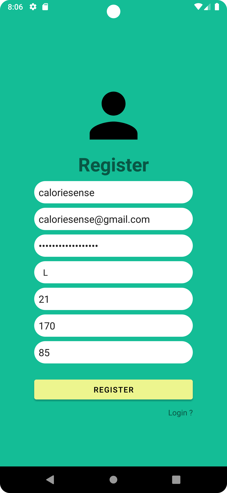
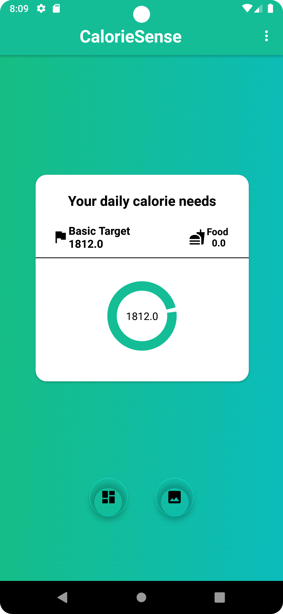
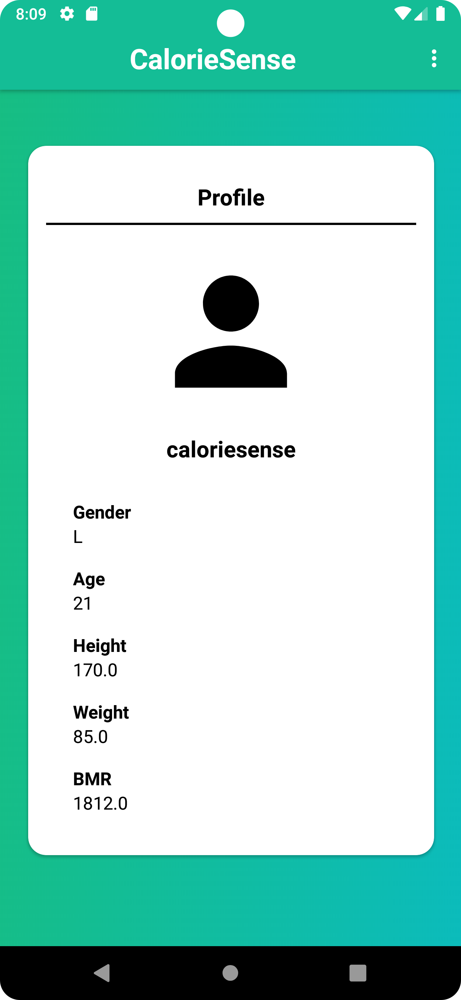
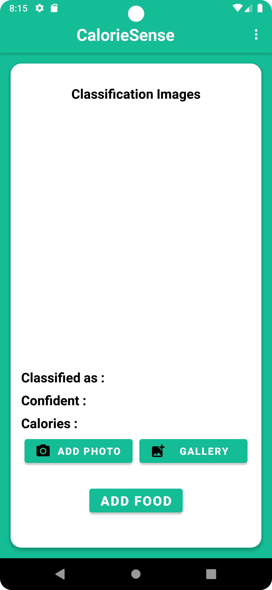
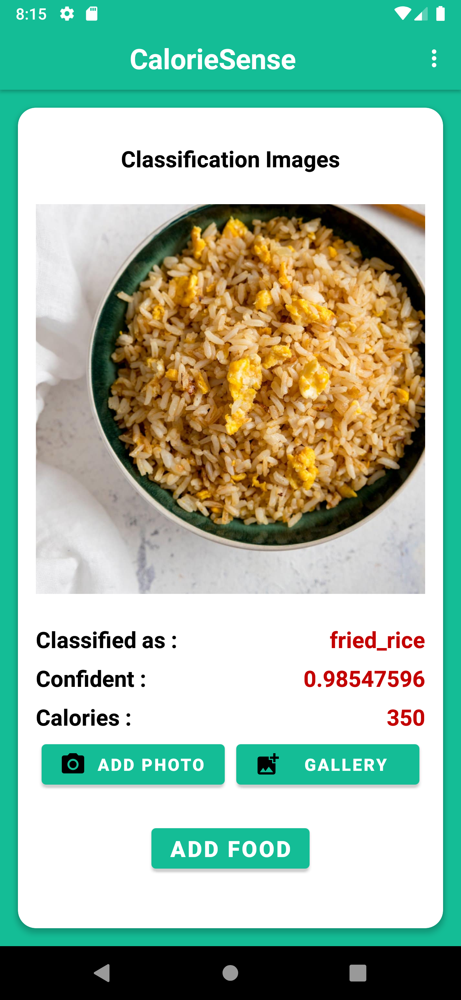
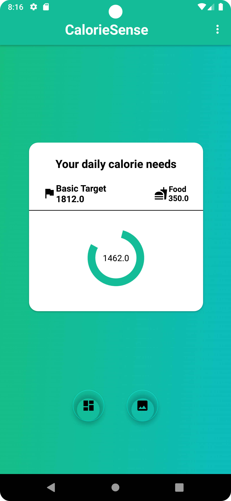

# C23-PS117 Android

<h1 align="center">
  Calorie Sense
</h1>

   Android Studio application for calculating BMR or Basal Metabolic Rate. And also the BMR calculation through calorie reduction based on image classification.

## Table of Contents
- [Installation](#installation)
- [Screenshoot](#screenshoot)

## Installation
- Clone this repository
- copy images from example images to perform image classification tests 

## Screenshots

### Register

### Login

### Homepage

### Profile

### Classification

### Classification Update

### Homepage Update

